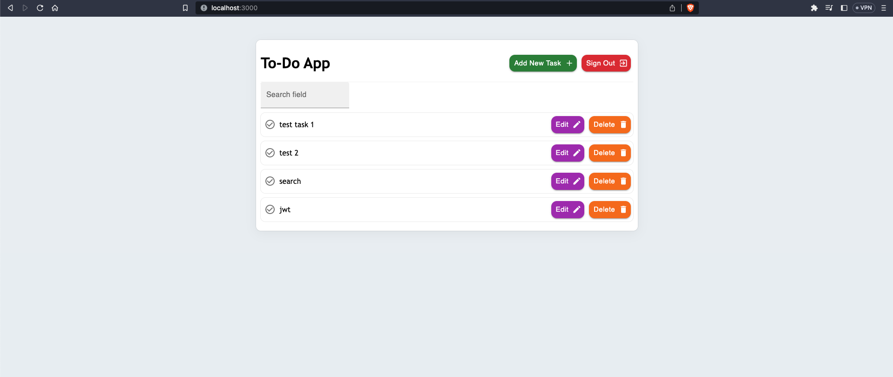
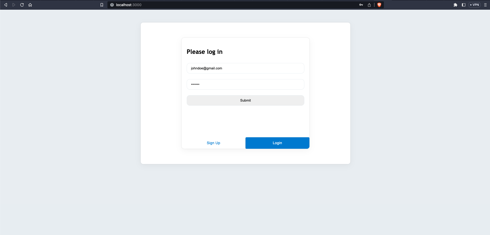
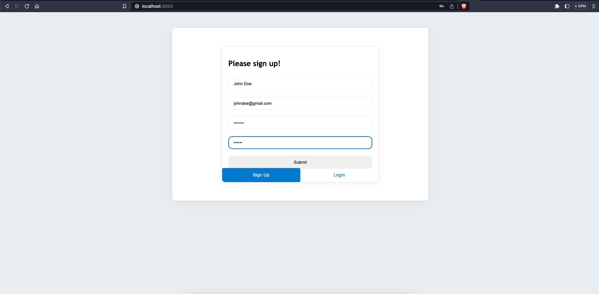
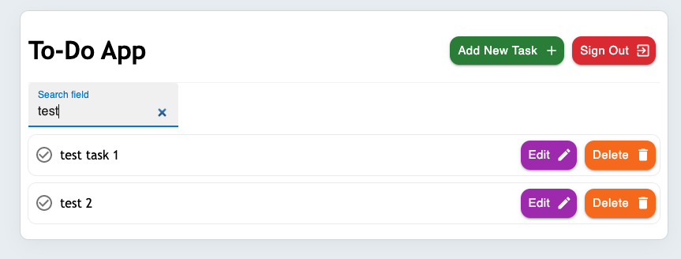
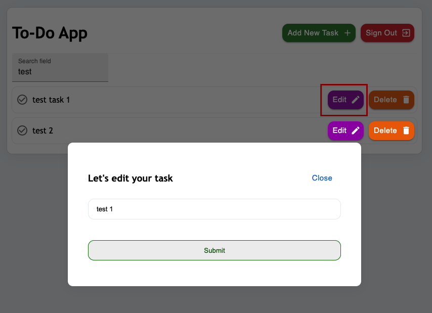
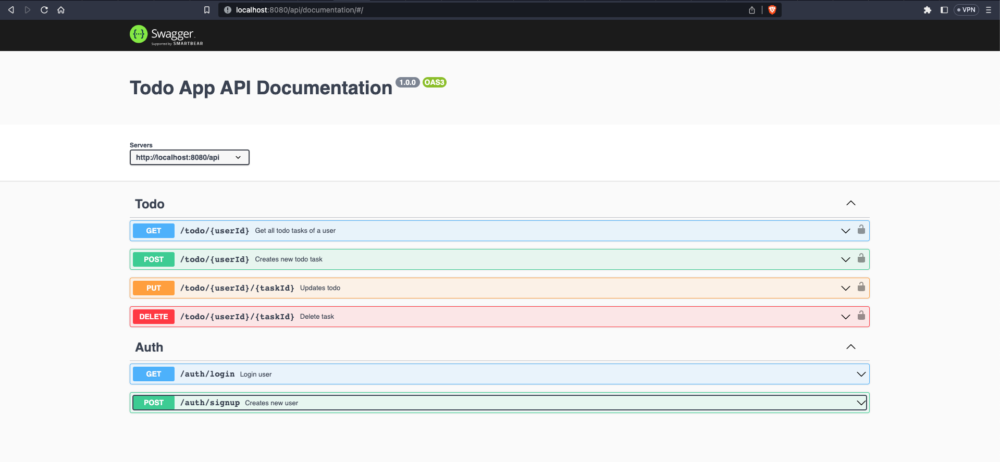
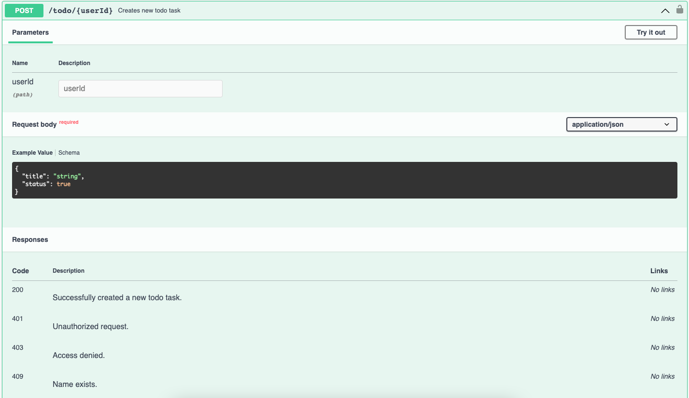
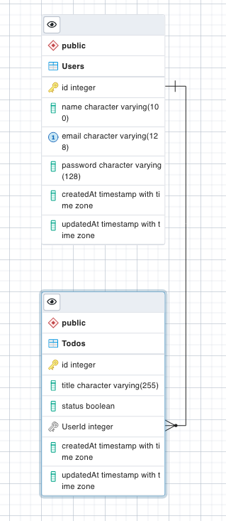
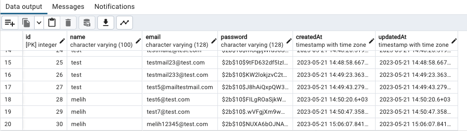
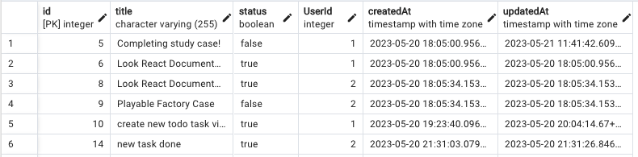

# To-Do App

## About
To-Do App Case Study made for Playable Factory Software Engineer position. Used PERN stack while developing the project. 



## Table of Contents

- [Installation](#installation)
- [Usage](#usage)
- [Acknowledgement](#acknowledgement)

## Installation
To get started with the project, you can clone project to your local machine by running:
``` 
https://github.com/MelihCelik00/todo-app.git
```

Since I used PERN stack, you have to download related packages too. For both server and client, there is seperate folders and package.json files in them. So after you downloaded, you have to run:

> cd backend && npm install

> cd frontend && npm install

After you installed all the packages, you can run the project by running (Since the project is not deployed at all, please run in seperate terminals):

> cd backend && npm run local

> cd frontend && npm run start

## Usage

I will mentioned about usage of the project in this section. There will be two different sections, one for the users and one for the developers.

### - Users

Users can use the app by signing up and logging in. 
 


After logging in, they can create new tasks, update them and delete them. They can also search for a specific task by its name.




### - Developers

Developers can use the app by cloning the project to their local machine. After cloning, they can run the project by following the instructions in the [Installation](#installation) section. To illustrate what's happening in backend I also documented the code on Swagger. You can access it by running the project and going to http://localhost:8080/api/documentation.




## Database
**For the database**, I used PostgreSQL and Sequelize ORM for a faster development. I have 

You can run the migration files by running:

> sequelize db:migrate

I have created two tables for this project: Todo and User. Todo table has a foreign key to User table. I have used this approach to make sure that users can only see their own tasks.





## Acknowledgement

Thanks to Playable Factory for giving me this opportunity to work on this case study. I have learned a lot during the development of this project. Prior to starting, I had no experience in frontend development, but now I have gained a good understanding of React. Additionally, I have further strengthened my backend development skills. I am excited to hear your feedback and further discuss the project and the role.